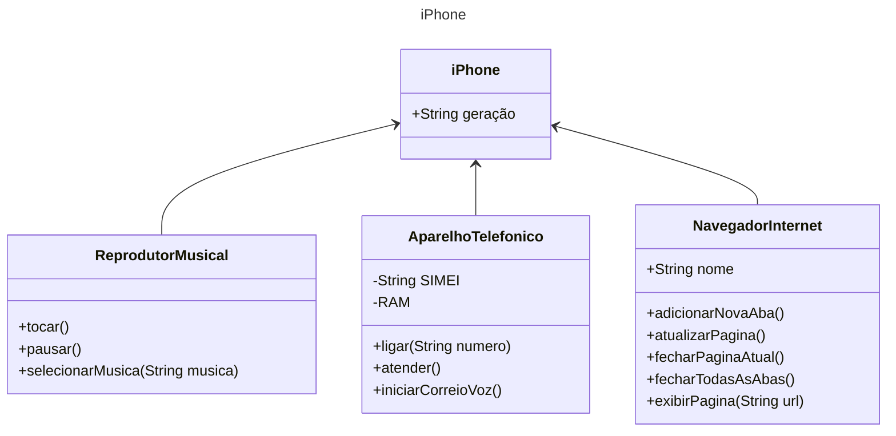

# Protótipo de iPhone

## Diagrama de Classes

```mermaid
---
title: iPhone
---
classDiagram
    class ReprodutorMusical {
        +tocar()
        +pausar()
        +selecionarMusica(String musica)
    }

    class AparelhoTelefonico {
        -String SIMEI
        -RAM
        +ligar(String numero)
        +atender()
        +iniciarCorreioVoz()
    }

    class NavegadorInternet {
        +String nome
        +adicionarNovaAba()
        +atualizarPagina()
        +fecharPaginaAtual()
        +fecharTodasAsAbas()
        +exibirPagina(String url)
    }

    class iPhone {
        +String geração
    }

    iPhone <-- ReprodutorMusical
    iPhone <-- AparelhoTelefonico
    iPhone <-- NavegadorInternet
```